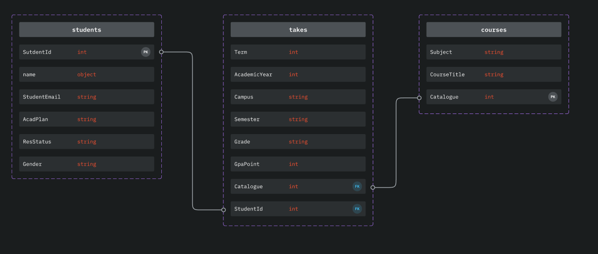

# Ict-Dashboard

<!-- ABOUT THE PROJECT -->
## About The Project

This is a web application that was developed during an internship within the ICT Graduate School. It is a dashboard that integrates student and course data to help teachers be more effective. Visualizing the data makes it easier to present and more readable information. The course data analysis allows for better suggestions and more improvements to be made.

### Built With MERN stack
Built Using Languages and Libraries Listed Below 
* [React](https://react.dev/)
* [Node](https://nodejs.org/en)
* [Express](https://expressjs.com/)
* [MongoDB](https://www.mongodb.com/)
* [Material-UI](https://mui.com/material-ui/getting-started/overview/)
* [Recharts](https://recharts.org/en-US/api)

<!-- GETTING STARTED -->
## Getting Started

### Installation

1. Clone the repo
```sh
git clone https://github.com/UOA-MINFOTECH-INTERNSHIPS/ict-dashboard.git
```
2. Install dependency for server side and client side
```sh
npm i
```
1. Run server(localhost:3000) and client(localhost:3001):
```sh
npm start
```
### Configuration

Initialize local mongoDB
```sh
npm init-db
```

### Structure

#### Frontend
    |-- public
    |-- src
        |-- Components
            |-- CourseComparison
            |-- CourseDetails
            |-- CourseReport
            |-- Dashboard
            |-- DepartmentDetails
            |-- ReportsHomePage
            |-- SharedComponent
            |-- Studentfilter
            |-- ViewCourses
        |-- hooks
        |-- App.js
        |-- index.js
    |-- README.md

#### Backend
    |-- src
        |-- controllers
        |-- db
        |-- routes
    |-- server.js

#### Database


## Development Database and future deployment
At this stage, the MongoDB database is connected to the application, but the data is dummy data, may change to some real data from remote databse in the future. However, the deployment of the application is still left, this will be done in the future.

<!-- CONTRIBUTING -->
## Contributing

Contributions are what make the open source community such an amazing place to be learn, inspire, and create. Any contributions you make are **greatly appreciated**.

1. Fork the Project
2. Create your Feature Branch (`git checkout -b feature/AmazingFeature`)
3. Commit your Changes (`git commit -m 'Add some AmazingFeature'`)
4. Push to the Branch (`git push origin feature/AmazingFeature`)
5. Open a Pull Request

<!-- CONTRIBUTORS -->
## Contributors
<!-- ALL-CONTRIBUTORS-LIST:START - Do not remove or modify this section -->
<!-- prettier-ignore-start -->
<!-- markdownlint-disable -->
<table>
  <tbody>
    <tr>
      <td align="center"><a href="https://github.com/AalexWang9527"><br /><sub><b>Jiawei Wang</b></sub></a>
      <td align="center"><a href="https://github.com/QiaochuSong"><br /><sub><b>Qiaochu Song</b></sub></a>
      <td align="center"><a href="https://github.com/Prz-Coral"><br /><sub><b>Peirong Zhao</b></sub></a>
    </tr>
    <tr>
      <td align="center"><a href="https://github.com/BailingAn1"><br /><sub><b>Bailing An</b></sub></a>
      <td align="center"><a href="https://github.com/XiaolinLi556"><br /><sub><b>Xiaolin Li</b></sub></a>
      <td align="center"><a href="https://github.com/GlennHua"><br /><sub><b>Ziyu Hua</b></sub></a>
    </tr>
    <tr>
      <td align="center"><a href="https://github.com/Xbai577"><br /><sub><b>Xinmiao Bai</b></sub></a>
      <td align="center"><a href="https://github.com/OllieYu"><br /><sub><b>Yingquan Yu</b></sub></a>
    </tr>
  </tbody>
</table>

<!-- ACKNOWLEDGMENTS -->
## Acknowledgments

This project was conducted supported by Dr Andrew Meads and Dr Yu-Cheng Tu of the Department of Computer Science at the University of Auckland